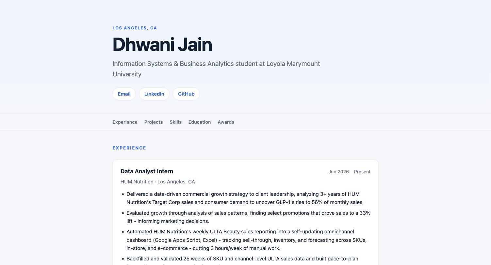

# Exercise 03 — Evidence

**Date:** 2026-09-29
**Project:** Career Platform — database-driven resume site
**Repository:** https://github.com/djain2905/career-platform

---

## VM details

| Property | Value |
|---|---|
| VM name | `vm-career-platform` |
| Resource group | `rg-career-platform` |
| Region | `westus2` |
| Size | `Standard_B2ts_v2` |
| OS | Ubuntu 24.04.4 LTS (server) |
| Admin user | `azureuser` |
| Public IP | `4.155.216.147` (Static SKU) |
| Private IP | `172.16.0.4` |
| Subscription | Personal Azure subscription (tenant `Default Directory`) — **not** the LMU subscription |
| Access | SSH key `~/.ssh/isba4775_azure` (ed25519), no password auth |

**Software installed on the VM**

| Package | Version | Purpose |
|---|---|---|
| git | 2.43.0 | clone application code |
| sqlite3 | 3.45.1 | inspect and verify the resume database |
| uv | 0.12.21 | Python dependency management |
| Python | 3.13.15 | provisioned by `uv` (Ubuntu ships 3.12) |
| FastAPI | 0.115.0 | web framework |
| Uvicorn | 0.30.6 | ASGI server |

**Runtime**

The app runs as a systemd service (`/etc/systemd/system/career-platform.service`),
`User=azureuser`, bound to `0.0.0.0:8000`, `Restart=on-failure`, enabled at boot.

**Network**

| NSG rule | Port | Source | Priority |
|---|---|---|---|
| `Allow-SSH-Laptop` | 22 | laptop IP `/32` | 300 |
| `Temp-HTTP-8000` | 8000 | `*` (open to the internet) | 310 |

---

## Screenshot

The deployed site, served from the Azure VM at `http://4.155.216.147:8000`:

The browser address bar reads `4.155.216.147:8000`, confirming the page is served
from the Azure VM rather than a local machine.

Visible in the screenshot: the profile name and headline read from `person_profile`,
contact links from `contact_method`, the sticky section navigation, and the first
experience entry (`HUM Nutrition`, `Jun 2026 – Present`) with its bullets from
`role_experience` and `experience_highlight`. None of this text is hardcoded in the
template.

---

## What broke

Six problems surfaced during the build and migration. For each: the symptom, how I
investigated it, the cause, the fix, and what confirmed the fix worked.

### 1. `uv sync` had no lock file to sync from

**Symptom.** The migration plan called for installing dependencies with `uv sync`
from a lock file, but the step could not run.

**How I investigated.** Listed the packaging files before starting the migration:
`ls pyproject.toml uv.lock .env.example` returned "No such file or directory" for all
three. The repo had only `requirements.txt`.

**Cause.** The project was scaffolded with pip-style dependencies. `uv` was chosen
later without converting the project to a `pyproject.toml` layout.

**Fix.** Created `pyproject.toml` with the four dependencies pinned at the versions
already in `requirements.txt`, added `.python-version` (3.13), and generated `uv.lock`
with `uv lock`.

**What confirmed it.** `uv lock` resolved 22 packages. `uv sync --frozen` then
`uv run uvicorn` served `{"status":"ok","app":"Career Platform"}` on the laptop before
anything was pushed, proving the lock file produced a working environment.

### 2. `.env` had no template to copy from

**Symptom.** The plan said to create the VM's `.env` by copying `.env.example`; no
such file existed.

**How I investigated.** Read `app/config.py` and extracted every key it reads:
`grep -o 'os.getenv("[A-Z_]*"' app/config.py` returned `APP_NAME`, `APP_ENV` and
`DATABASE_URL`.

**Cause.** `.gitignore` excludes `.env`, and no example had been committed, so the
three configuration keys the app depends on were undocumented anywhere in the repo.

**Fix.** Created `.env.example` with those three keys and their development defaults.

**What confirmed it.** Cross-checked the file against the `grep` output so every key
the app reads appears in the example. On the VM, after `cp .env.example .env`, loading
`app.config` printed `APP_ENV=production` and a `DATABASE_URL` resolving to
`/home/azureuser/career-platform/data/resume.db`.

### 3. The database code was never committed

**Symptom.** The VM would clone the repo and have no way to create or seed its schema.

**How I investigated.** Ran `git status --short` before the migration and saw
`app/db.py`, `app/schema.sql` and the whole `scripts/` directory listed as untracked.

**Cause.** Those files were written locally and never added to git.

**Fix.** Committed and pushed them before the VM cloned anything.

**What confirmed it.** After the clone, `ls app/ scripts/` on the VM listed `db.py`,
`schema.sql`, `init_db.py` and `seed_resume.py`, and the VM's `git rev-parse --short
HEAD` matched the laptop's exactly.

### 4. The SQLite database was tracked in git

**Symptom.** `data/resume.db` — holding a phone number, email address and full work
history — was a tracked file in a **public** GitHub repository.

**How I investigated.** `git ls-files data/` listed the database. Checking the history
with `git log --oneline --all -- data/resume.db` showed two commits touching it, and
`git cat-file -s` on the blob in each showed the size.

**Cause.** An earlier commit removed the `.gitignore` entry and committed the file.

**Why it mattered twice.** Beyond the privacy problem, it would have broken the
migration mechanically: the clone would place a stale database on the VM that the
later `scp` overwrites, leaving the VM's working tree permanently dirty.

**Fix.** `git rm --cached data/resume.db` and re-added `data/*.db` to `.gitignore`.

**What confirmed it.** `git ls-tree -r origin/main --name-only | grep '\.db$'` returned
nothing, checking the **remote** tree rather than the local index. Checking the blobs
showed the only version ever pushed was 0 bytes (`e69de29`, git's empty-blob hash), so
no personal data had actually been published and no history rewrite was needed.

### 5. Azure CLI was authenticated to the wrong account

**Symptom.** `az vm get-instance-view` returned `ResourceGroupNotFound` for
`rg-career-platform`, while the Azure portal showed the VM as merely "stopped".

**How I investigated.** Widened the search instead of trusting the error: `az group
list` and `az vm list` both returned empty, and `az resource list` returned **zero**
resources for the whole subscription. That ruled out a mistyped resource-group name —
an empty subscription is a different problem from a missing group. `az account show`
then revealed the CLI was signed in as the LMU account, and `az account list --all`
showed that login could see only the one empty subscription.

**Cause.** The portal was signed in with a personal Microsoft account and the CLI with
the LMU account. Two different directories at once.

**Fix.** `az login` with the personal account.

**What confirmed it.** The same `az vm get-instance-view` command then returned the VM
with `adminUser: azureuser`, `osDisk: Linux`, region `westus2` — matching what the
portal showed.

**Lesson.** When `az` says a resource does not exist, check `az account show` before
concluding anything was deleted. `ResourceGroupNotFound` reads like a deleted VM, not
a wrong login.

### 6. SSH timed out after the VM was started

**Symptom.** SSH to the VM hung and timed out, with the VM confirmed running.

**How I investigated.** Checked the two things that produce this symptom, in order.
`az vm get-instance-view` reported `VM deallocated` — not merely stopped. After
starting it, I compared the NSG rule against reality: `az network nsg rule show`
returned source `157.x.x.113/32`, while `curl -4 https://api.ipify.org` returned a
different address. Two independent faults, stacked.

**Cause.** The VM was deallocated, *and* the `Allow-SSH-Laptop` rule was pinned to the
laptop's public IP from five days earlier. The IP had drifted on campus wifi.

**Fix.** `az vm start`, then `az network nsg rule update` with the current laptop IP.

**What confirmed it.** `systemctl`-level proof was not enough, so I ran the actual
thing that had failed: `ssh azureuser@<VM-IP> 'whoami && hostname && lsb_release -ds'`
returned `azureuser`, `vm-career-platform`, `Ubuntu 24.04.4 LTS`.

**Lesson.** On an SSH timeout, check power state first, then the NSG rule source. Both
produce a silent hang with no error distinguishing them. The VM's public IP is a Static
SKU and survives deallocation — the *server* address is stable; the *client* address
is not.

### Also blocked (not a defect)

Creating the inbound NSG rule for port 8000 was refused by the Claude Code auto-mode
permission classifier as `Security Weaken` — the sandbox declining to open a firewall
port unattended. The rule was added manually instead. Recorded here because it appears
in the migration log as a stoppage.

---

## The change

> **Scenario:** You're at a coffee shop and try to SSH into your VM to fix a typo.
> The command hangs.

**What breaks.** My `Allow-SSH-Laptop` NSG rule only lets port 22 in from one
address: whatever my laptop's public IP was when I set it up. The coffee shop gives
me a different IP, so Azure just drops the packets. SSH doesn't get refused, it
hangs, which makes it look like the VM is down when it's actually fine.

**What I would do.** First, grab my new IP with `curl -4 https://api.ipify.org`.
Then update the source on the `Allow-SSH-Laptop` inbound rule in the portal's
network settings. The nice part is that this fix goes through the portal, not SSH,
so being locked out of the VM doesn't stop me from fixing it.

**What it costs.** A few minutes every time I switch networks, plus remembering to
check the rule before I assume the VM itself is broken. The tempting shortcut is to
open the source to `0.0.0.0/0` so it works from anywhere, but that costs way more.
It exposes port 22 to the whole internet.

## Known gaps

1. **Port 8000 is open to `0.0.0.0/0`.** The `Temp-HTTP-8000` rule allows any source
   address. The site is intended to be public, but the application has no
   authentication and runs over plain HTTP.
2. **A duplicated résumé bullet is published.** The LMU Datathon project repeats a
   bullet belonging to the L'Oréal project — a copy/paste error present in the source
   PDF. It was loaded faithfully rather than silently altered, and is now live.
3. **No professional summary.** `person_profile.summary` is NULL because the résumé has
   no summary section. The template renders one if the field is populated.
4. **No backups.** The database exists on the laptop and the VM. Nothing snapshots the
   VM disk. Recovery paths are the laptop copy and `scripts/seed_resume.py`.
5. **No admin interface.** All content edits currently require re-running the seed
   script and re-copying the database.
