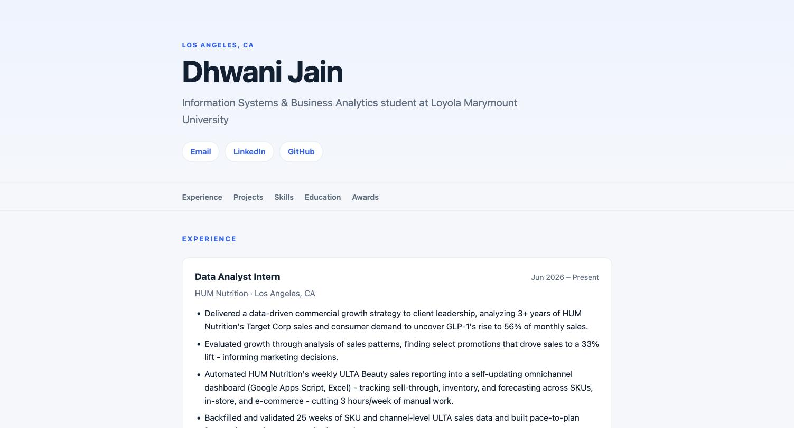

# Exercise 03 — Evidence

**Date:** 2026-09-29
**Project:** Career Platform — database-driven resume site
**Repository:** https://github.com/djain2905/career-platform

---

## VM details

| Property | Value |
|---|---|
| VM name | `vm-career-platform` |
| Resource group | `rg-career-platform` |
| Region | `westus2` |
| Size | `Standard_B2ts_v2` |
| OS | Ubuntu 24.04.4 LTS (server) |
| Admin user | `azureuser` |
| Public IP | `4.155.216.147` (Static SKU) |
| Private IP | `172.16.0.4` |
| Subscription | Personal Azure subscription (tenant `Default Directory`) — **not** the LMU subscription |
| Access | SSH key `~/.ssh/isba4775_azure` (ed25519), no password auth |

**Software installed on the VM**

| Package | Version | Purpose |
|---|---|---|
| git | 2.43.0 | clone application code |
| sqlite3 | 3.45.1 | inspect and verify the resume database |
| uv | 0.12.21 | Python dependency management |
| Python | 3.13.15 | provisioned by `uv` (Ubuntu ships 3.12) |
| FastAPI | 0.115.0 | web framework |
| Uvicorn | 0.30.6 | ASGI server |

**Runtime**

The app runs as a systemd service (`/etc/systemd/system/career-platform.service`),
`User=azureuser`, bound to `0.0.0.0:8000`, `Restart=on-failure`, enabled at boot.

**Network**

| NSG rule | Port | Source | Priority |
|---|---|---|---|
| `Allow-SSH-Laptop` | 22 | laptop IP `/32` | 300 |
| `Temp-HTTP-8000` | 8000 | `*` (open to the internet) | 310 |

---

## Screenshot

The deployed site, served from the Azure VM at `http://4.155.216.147:8000`:



Visible in the screenshot: the profile name and headline read from `person_profile`,
contact links from `contact_method`, the sticky section navigation, and the first
experience entry (`HUM Nutrition`, `Jun 2026 – Present`) with its bullets from
`role_experience` and `experience_highlight`. None of this text is hardcoded in the
template.

---

## What broke

Six problems surfaced during the migration. Each is recorded with its symptom,
cause and fix.

### 1. `uv sync` had no lock file to sync from

**Symptom:** the migration plan called for `uv sync` from a lock file, but the repo
contained neither `pyproject.toml` nor `uv.lock` — only a `requirements.txt`.

**Cause:** the project was scaffolded with pip-style dependencies; `uv` was chosen
later without converting the project.

**Fix:** created `pyproject.toml` with the four dependencies pinned at their existing
versions, plus `.python-version` (3.13), then generated `uv.lock`. Verified locally
before pushing.

### 2. `.env` had no template to copy from

**Symptom:** the plan said to copy `.env` from `.env.example`; no `.env.example` existed.

**Cause:** `.gitignore` excludes `.env`, and no example file had been committed, so the
three config keys `app/config.py` reads were undocumented.

**Fix:** created `.env.example` containing `APP_NAME`, `APP_ENV` and `DATABASE_URL`,
cross-checked against every `os.getenv` call in `app/config.py`.

### 3. The database code was never committed

**Symptom:** `app/db.py`, `app/schema.sql` and the whole `scripts/` directory were
untracked. A `git clone` on the VM would have produced an app with no way to create
or seed its schema.

**Cause:** the files were written locally and never added to git.

**Fix:** committed and pushed before the VM cloned anything. The clone was then
gate-checked to confirm all files arrived.

### 4. The SQLite database was tracked in git

**Symptom:** `data/resume.db` was a tracked file in a **public** GitHub repository.

**Cause:** an earlier commit removed the `.gitignore` entry and committed the file.

**Impact:** two problems — personal data (phone number, email, work history) would be
published on every push, and the clone would place a stale database on the VM that the
later `scp` would overwrite, leaving the working tree permanently dirty.

**Fix:** `git rm --cached data/resume.db` and re-added `data/*.db` to `.gitignore`.
Verified the blob history: the only version ever pushed was 0 bytes (`e69de29`, git's
empty-blob hash), so no personal data had actually been published. No history rewrite
was needed.

### 5. Azure CLI was authenticated to the wrong account

**Symptom:** `az vm get-instance-view` returned `ResourceGroupNotFound` for
`rg-career-platform`. The Azure portal showed the VM as merely "stopped".

**Cause:** the CLI was signed in with the LMU account (`@lion.lmu.edu`), whose
subscription contains **zero** resources, while the VM lives in a personal Azure
account. `az resource list` returned 0 resources, and `az account list --all` showed
only the one empty subscription.

**Why it was confusing:** `ResourceGroupNotFound` reads like a deleted VM, not a wrong
login. The portal and the CLI were pointed at two different directories at once.

**Fix:** `az login` with the personal account. All resources appeared immediately.

**Lesson:** when `az` says a resource does not exist, check `az account show` before
concluding anything was deleted.

### 6. SSH timed out after the VM was started

**Symptom:** SSH to the VM hung and timed out, even with the VM confirmed running.

**Cause:** two independent faults stacked. The VM was deallocated (not just stopped),
*and* the `Allow-SSH-Laptop` NSG rule was pinned to a laptop IP from five days earlier.
The laptop's public IP had drifted on campus wifi.

**Why it was confusing:** a deallocated VM and a stale NSG rule produce an identical
symptom — a silent timeout with no error message distinguishing them.

**Fix:** started the VM with `az vm start`, and updated the NSG rule source to the
laptop's current IP. Verified with `curl -4 https://api.ipify.org` before setting it.

**Lesson:** on an SSH timeout, check power state first, then the NSG rule source.
The public IP is a Static SKU, so it survives deallocation — the *server* address is
stable; the *client* address is not.

### Also blocked (not a defect)

Creating the inbound NSG rule for port 8000 was refused by the Claude Code auto-mode
permission classifier as `Security Weaken` — the sandbox declining to open a firewall
port unattended. The rule was added manually instead. Noted here because it appears in
the migration log as a stoppage.

---

## The change

> **Note:** the exercise prompt was not available in this repository, so this section
> answers "the change" as *what changed in this deployment, and why*. If the prompt
> asks something more specific, this section should be revised.

**Before.** The application ran only on a laptop. The public page was a static Jinja2
placeholder: `app/main.py` exposed two routes (`/health` and `/`), and `index.html`
rendered a single hardcoded heading. No route read the database. The SQLite file was
empty — 0 bytes, no tables — and was tracked in a public git repository.

**After.** The application runs on an Azure VM under systemd, serving over the public
internet, and renders the profile from SQLite on every request.

The change had three parts.

**1. Schema and data.** Created a 14-table schema (`app/schema.sql`) modelled on the
project specification's content model — profile, contacts, experience, projects,
skills, education, certifications, achievements, content sections and tags, with
draft/published/archived lifecycle columns. Loaded the resume into it via
`scripts/seed_resume.py`, which is re-runnable and idempotent. The database is copied
to the VM by `scp`, never through git, so personal data stays out of the public
repository.

**2. Deployment.** Code reaches the VM by `git clone`; dependencies install from
`uv.lock` with `uv sync --frozen --no-dev`, so the VM's environment is reproducible
rather than hand-assembled. Configuration comes from `.env` (mode 600). The app runs as
a systemd service so it survives logout and reboot.

**3. Rendering.** Added `app/repository.py`, whose `load_profile()` runs seven queries
and returns one nested dictionary. `main.py` calls it and passes the result to a
rewritten single-page template.

The design decision worth naming: **that dictionary is also the cache format.** The
specification requires the public profile to stay visible when the database is
unavailable. Because the live read and the cached read return the same structure, the
fallback is two lines around one function call rather than a parallel code path that
could drift:

```
load_profile()
├─ live:     query SQLite → write data/snapshot.json → return (data, "live")
├─ snapshot: SQLite failed → read snapshot.json      → return (data, "snapshot")
└─ minimal:  both failed   → module constant         → return (data, "minimal")
```

Snapshot writes are atomic (temp file then `os.replace`), so a crash mid-write cannot
leave truncated JSON that poisons every later fallback. When the source is not `live`,
the page shows a "Showing saved content" notice — the specification asks that fallback
be distinguishable from live data without exposing internal errors.

This was verified by moving the database file away and requesting the page: HTTP 200,
full content, cache notice displayed.

**One further decision:** phone numbers are filtered inside the repository, before the
dictionary is built, so the number reaches neither the rendered page nor the snapshot
file. Enforcing it at one chokepoint means a future template or API endpoint cannot
leak it by omission.

**Verification.** 16 tests cover dictionary shape, ordering, exclusion of draft
records, phone filtering, date formatting and all three fallback tiers. The deployed
site was checked for all five roles, three projects, skills, education and awards, and
confirmed to contain no phone number.

---

## Known gaps

1. **Port 8000 is open to `0.0.0.0/0`.** The `Temp-HTTP-8000` rule allows any source
   address. The site is intended to be public, but the application has no
   authentication and runs over plain HTTP.
2. **A duplicated résumé bullet is published.** The LMU Datathon project repeats a
   bullet belonging to the L'Oréal project — a copy/paste error present in the source
   PDF. It was loaded faithfully rather than silently altered, and is now live.
3. **No professional summary.** `person_profile.summary` is NULL because the résumé has
   no summary section. The template renders one if the field is populated.
4. **No backups.** The database exists on the laptop and the VM. Nothing snapshots the
   VM disk. Recovery paths are the laptop copy and `scripts/seed_resume.py`.
5. **No admin interface.** All content edits currently require re-running the seed
   script and re-copying the database.
